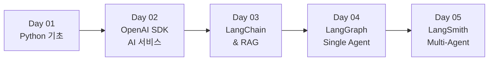
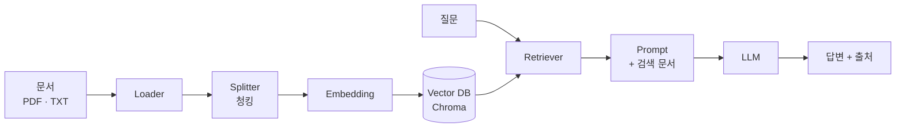
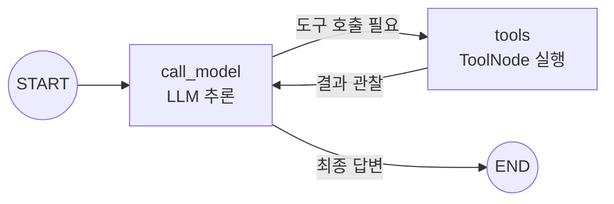
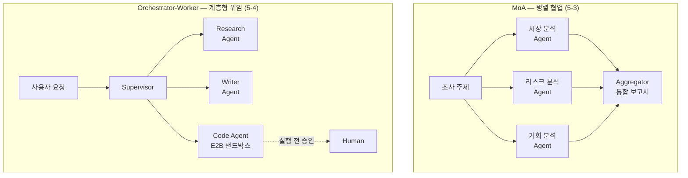

<div align="center">

# 🤖 GenAI Agent Lab

**생성형 AI의 원리부터 LangChain·LangGraph 기반 Multi-Agent까지**
AI Agent 개발 과정을 5일 단위로 정리하고, 실습으로 직접 구현하며 기록한 학습 저장소


</div>

---

## 소개

AI Agent 개발 실전 과정(Python 기초 → OpenAI SDK → LangChain/RAG → LangGraph/Single Agent → Multi-Agent)을 수강한 뒤, 배운 내용을 스스로 복습하며 **개념 정리(`notes/`)** 와 **실습 코드(`practice/`)** 를 함께 기록한 저장소입니다.

강의 내용을 그대로 옮기지 않고, 각 개념이 **실제 Agent 개발(도구 설계, State 관리, RAG, Multi-Agent)에 왜 필요한지**를 중심으로 정리했습니다.
예를 들어 Python의 type hint는 "`@tool`이 LLM에게 넘길 JSON Schema를 만드는 재료", 반복문은 "Agent Loop를 이해하는 기초"라는 관점으로 다룹니다.

| 구성 | 규모 |
|---|---|
| 학습 노트 | Day별 5편 — 개념 설명, 비교표, 흔한 실수 정리 |
| 실습 노트북 | 19개 (Jupyter) |
| 웹 앱 | Streamlit 앱 2종 (카카오 장소 추천, ChatPDF) |

## 학습 로드맵

단순 LLM 호출에서 시작해 RAG → 단일 Agent → 멀티 Agent로 한 단계씩 확장합니다.



| Day | 주제 | 핵심 키워드 | 대표 실습 |
|---|---|---|---|
| 01 | Python 기초 | 자료형, 제어문, 함수·클래스, 데코레이터, 예외처리, Streamlit | 학습 노트 |
| 02 | OpenAI SDK 기반 AI 서비스 | LLM 원리, 프롬프트·컨텍스트 엔지니어링, 외부 API 연동 | 주식 분석 리포트, 캠핑장·장소 추천 |
| 03 | LangChain & RAG | LCEL, Tool Calling, Output Parser, 벡터 DB, 하이브리드 검색 | ChatPDF 챗봇 |
| 04 | LangGraph & Single Agent | `create_agent`, StateGraph, 조건부 엣지, ReAct | ReAct Agent 직접 구현 |
| 05 | LangSmith & Multi-Agent | Tracing, MoA, Orchestrator-Worker, Human-in-the-Loop | 금융 리서치 MoA, Supervisor 멀티 에이전트 |

---

## Day별 학습 내용 & 실습

### Day 01 — Python 기초

> 📝 [학습 노트](<notes/Day01_학습정리.md>)

Agent 개발에 필요한 Python 문법을 **"이 문법이 Agent의 어디에 쓰이는가"** 관점으로 정리했습니다.

| 주제 | Agent 개발과의 연결 |
|---|---|
| 변수와 자료형 | type hint가 `@tool`의 JSON Schema 생성 재료가 됨 |
| 조건문과 반복문 | 도구 선택 분기, ReAct·LangGraph의 Agent Loop 구조 |
| 리스트·딕셔너리·JSON | LLM 메시지·도구 호출 인자·실행 결과가 모두 `dict` 기반 |
| 함수와 클래스 | 도구는 함수로, Agent의 메모리·State는 클래스로 정의 |
| 데코레이터와 모듈 | `@tool` 같은 프레임워크 문법 이해 |
| 예외처리와 파일 입출력 | 도구 실행 실패 처리, 데이터 저장 |
| Streamlit | AI 서비스용 웹 UI를 빠르게 구성 |

### Day 02 — OpenAI SDK 기반 AI 서비스 구현

> 📝 [학습 노트](<notes/Day02_학습정리.md>) · 💻 [실습 폴더](<practice/Day02_실습>)

**학습 내용**
- **LLM 기본 개념**: 확률적 생성과 결정적 선택, LLM 발전사, 주요 모델 비교, LLM의 한계
- **프롬프트 엔지니어링**: R-T-C-F 공식 — 역할(Role) + 목표(Task) + 맥락(Context) + 출력형식(Format)
- **컨텍스트 엔지니어링**: LLM에게 "무엇을 알려줄지" 설계하기

**실습** — 외부 데이터를 가져와 LLM의 컨텍스트로 넣는 **`데이터 조회 → 컨텍스트 구성 → LLM 응답`** 패턴을 반복해서 구현

| 실습 | 내용 | 사용 기술 |
|---|---|---|
| [2-1. 주식 시세 분석](<practice/Day02_실습/2-1. 주식시세분석.ipynb>) | 지정 기간의 삼성전자 주가를 조회·시각화하고, GPT가 분석 리포트 작성 | pykrx, pandas, matplotlib |
| [2-2. 캠핑장 추천](<practice/Day02_실습/2-2. 캠핑장추천.ipynb>) | 사용자 질문에서 키워드 추출 → 고캠핑 공공 API 검색 → 검색 결과 기반 추천 | 공공데이터포털 API |
| [2-3. 카카오맵 장소 추천](<practice/Day02_실습/2-3. 카카오맵장소추천.ipynb>) | 질문에서 지역·키워드 추출 → 카카오 로컬 API 검색 → 결과를 근거로 답변 생성 | Kakao Local API |
| [search_places.py](<practice/Day02_실습/search_places.py>) · [search_streamlit.py](<practice/Day02_실습/search_streamlit.py>) | 2-3을 함수 단위로 모듈화하고 Streamlit 웹앱으로 구현 | Streamlit |

### Day 03 — LangChain & RAG

> 📝 [학습 노트](<notes/Day03_학습정리.md>) · 💻 [실습 폴더](<practice/Day03_실습>)

**학습 내용**
- **LCEL**: `|` 연산자로 프롬프트·모델·파서를 연결하는 체인 구성, `RunnablePassthrough` / `RunnableParallel`
- **멀티턴 대화**: LLM은 Stateless하므로 대화 히스토리를 직접 누적해 전달
- **Function / Tool Calling**: LLM이 외부 함수를 호출하도록 도구 정의
- **Output Parser**: LLM 응답을 구조화된 데이터로 변환
- **RAG**: 문서 로더·청킹·임베딩·검색 방식 비교, 출처 표시, RAG의 한계

**RAG 파이프라인**



**실습**

| 실습 | 내용 |
|---|---|
| [3-1. LCEL로 LangChain 구현하기](<practice/Day03_실습/3-1. LCEL로 Langchain 구현하기.ipynb>) | 기본 체인 → 스트리밍 → 배치 처리 → 시스템 프롬프트 → 멀티턴 히스토리 → JSON 출력 → 순차 체인까지 7단계 |
| [3-2. LangChain 입력 다루기](<practice/Day03_실습/3-2. LangChain 입력다루기.ipynb>) | OpenAI Chat Completions와 Responses API 비교, System·Human·AI 메시지 구성, 동기·비동기 호출, PromptTemplate |
| [3-3. Tool Calling 다루기](<practice/Day03_실습/3-3. ToolCalling 다루기.ipynb>) | OpenAI SDK function calling과 LangChain `@tool` 비교, OpenWeatherMap API로 실시간 날씨 조회 도구 구현 |
| [3-4. Output Parser](<practice/Day03_실습/3-4. Parser 출력형식 다루기.ipynb>) | Pydantic·CommaSeparatedList·Json 파서 사용, `BaseOutputParser`를 상속한 커스텀 파서 직접 구현 |
| [3-5. LCEL 파이프라인](<practice/Day03_실습/3-5. LCEL 파이프라인.ipynb>) | `RunnableParallel`로 검색 결과와 질문을 병렬 구성하는 RAG의 기초 구조 |
| [3-6. RAG Chain](<practice/Day03_실습/3-6. RAG chain.ipynb>) | 사내 규정 문서로 로드 → 청킹 → 임베딩 → Chroma 저장 → 검색 → RAG 체인 구성, 출처 표시 RAG, 저장된 DB 재사용 |
| [3-7. 하이브리드 검색](<practice/Day03_실습/3-7.하이브리드검색.ipynb>) | 키워드 검색(BM25)과 벡터 검색(FAISS)을 `EnsembleRetriever`로 결합 |
| [3-8. ChatPDF 챗봇](<practice/Day03_실습/3-8. ChatPDF_Chatbot.ipynb>) | PDF 업로드 → 벡터 DB 자동 구축 → 멀티턴 RAG 대화, [`chatpdf_app.py`](<practice/Day03_실습/chatpdf_app.py>)로 Streamlit 웹앱 구현 |

### Day 04 — LangGraph & Single Agent

> 📝 [학습 노트](<notes/Day04_학습정리.md>) · 💻 [실습 폴더](<practice/Day04_실습>)

**학습 내용**
- **LangChain vs LangGraph**: 직선형 체인과 상태 기반 그래프의 차이
- **`create_agent()`**: 도구만 주면 Agent Loop를 자동 구성하는 고수준 API
- **StateGraph**: State(상태) · Node(작업) · Edge(흐름)로 워크플로우 설계
- **조건부 엣지**: 상태에 따라 다음 노드를 동적으로 선택
- **ReAct 패턴**: 추론(Reason) → 행동(Act) → 관찰(Observe) 루프를 직접 구현하고 `create_agent()`와 비교
- Agent 루프를 세밀하게 제어·관찰하는 방법, 흔한 실수 정리

**ReAct Agent 구조** (4-4에서 직접 구현)



**실습**

| 실습 | 내용 |
|---|---|
| [4-1. LangChain Agent](<practice/Day04_실습/4-1. Langcahin Agent.ipynb>) | `create_agent`로 도구 1개(날씨) → 2개(DuckDuckGo 검색 + 계산기) Agent, 시스템 프롬프트 설계로 주문 조회·상품 안내 CS Agent 구현 |
| [4-2. StateGraph 기초](<practice/Day04_실습/4-2. LangGraph StateGraph.ipynb>) | State·Node·Edge 정의 → 컴파일 → 시각화 → 실행, 카운터 그래프에서 LLM 챗봇 그래프로 확장, `invoke()`와 `stream()` 비교 |
| [4-3. 조건부 엣지](<practice/Day04_실습/4-3.LangGraph 조건부엣지.ipynb>) | 랜덤 날씨 분기 예제, 사용자 의도를 분석해 단순 응답·날씨·LLM 응답으로 라우팅하는 그래프 |
| [4-4. ReAct Single Agent](<practice/Day04_실습/4-4. SingleAgent_ReACT 기본구현.ipynb>) | `MessagesState` + `ToolNode` + 조건 분기로 ReAct 루프 수동 구현, 스트리밍으로 실행 과정 관찰, `create_agent()` 그래프와 비교 |

### Day 05 — LangSmith & Multi-Agent

> 📝 [학습 노트](<notes/Day05_학습정리.md>) · 💻 [실습 폴더](<practice/Day05_실습>)

**학습 내용**
- **LangSmith**: LLM 앱의 실행 과정·입출력·토큰·지연 시간을 추적하는 Observability
- **MoA (Mixture of Agents)**: 여러 에이전트를 병렬로 실행하고 결과를 통합하는 패턴
- **Orchestrator-Worker (Supervisor)**: 상위 에이전트가 하위 에이전트에게 작업을 위임하는 계층형 패턴
- **Human-in-the-Loop**: 위험한 도구 실행 전 사람의 승인을 받는 구조

**멀티 에이전트 패턴**



**실습**

| 실습 | 내용 |
|---|---|
| [5-1. LangSmith 기초](<practice/Day05_실습/5-1. LangSmith.ipynb>) | 체인의 Trace 트리(Prompt → Model → Parser) 확인, `run_name`·`tags`·`metadata`로 실행 구분, 스트리밍 추적 |
| [5-2. LangSmith Agent 추적](<practice/Day05_실습/5-2. LangSmith_Agent 추적.ipynb>) | 계산기(AST 기반 안전한 수식 평가)·날씨 도구 Agent의 Trace 분석, 체인과 Agent Trace 비교, 선택적 추적 |
| [5-3. MoA 금융 조사 보고서](<practice/Day05_실습/5-3. Multi_Agent_MoA.ipynb>) | 시장·리스크·기회 관점의 리서치 에이전트 3개가 Exa 웹 검색으로 병렬 조사 → Aggregator가 통합 보고서 작성, 도구 호출 횟수 제한·재시도 미들웨어 적용 |
| [5-4. Orchestrator-Worker](<practice/Day05_실습/5-4. Multi_Agent_Orchestrator_Worker.ipynb>) | 리서치·작성·코드 실행 Sub-agent를 도구로 감싸 Supervisor가 위임, `InjectedState`로 컨텍스트 전달, `HumanInTheLoopMiddleware`로 코드 실행 전 승인·거절 |

---

## 기술 스택

| 분야 | 기술 |
|---|---|
| 언어·환경 | Python, Jupyter Notebook |
| LLM | OpenAI API (`gpt-4o-mini`, `gpt-4.1-mini`, `text-embedding-3-small`) |
| 프레임워크 | LangChain (LCEL), LangGraph |
| 관찰성 | LangSmith |
| 벡터 DB·검색 | Chroma, FAISS, BM25, DocArray |
| 외부 도구·API | Exa 검색, E2B Code Interpreter, DuckDuckGo, OpenWeatherMap, 카카오 로컬, 고캠핑(공공데이터포털), pykrx |
| UI | Streamlit |

## 폴더 구조

```
genai-agent-lab/
├── README.md
├── notes/                  # Day별 학습 개념 정리 ("왜 AI Agent 개발에 필요한가" 관점)
│   ├── Day01_학습정리.md
│   ├── ...
│   └── Day05_학습정리.md
├── practice/               # 강의를 따라가며 직접 작성한 실습 코드
│   ├── Day02_실습/         # OpenAI SDK + 외부 API (노트북 3개, Streamlit 앱)
│   ├── Day03_실습/         # LangChain & RAG (노트북 8개, ChatPDF 앱, 실습 문서)
│   ├── Day04_실습/         # LangGraph & Single Agent (노트북 4개)
│   └── Day05_실습/         # LangSmith & Multi-Agent (노트북 4개)
└── projects/               # 직접 설계·구현한 AI Agent 프로젝트 (진행 예정)
```

- **notes/**: 강의 개념을 그대로 옮기지 않고, Python/LLM 개념이 실제 Agent 개발과 어떻게 연결되는지 정리합니다.
- **practice/**: 노트에 정리한 개념을 바탕으로 직접 코드를 작성하며 연습하는 공간입니다.
- **projects/**: 연습한 내용을 응용해 직접 설계·구현한 프로젝트를 담습니다. 프로젝트마다 별도 README로 목적·구조·실행 방법을 기록합니다.

## 실행 방법

**1. 가상환경 생성 및 패키지 설치**

```bash
python -m venv .venv
source .venv/bin/activate          # Windows: .venv\Scripts\activate
pip install openai python-dotenv pandas matplotlib koreanize-matplotlib pykrx streamlit \
            langchain langchain-core langchain-community langchain-openai langchain-classic \
            langchain-chroma langchain-text-splitters langgraph pypdf \
            faiss-cpu rank_bm25 docarray tiktoken ddgs exa_py e2b-code-interpreter
```

**2. `.env` 파일 작성** (루트에 생성, Git에는 올라가지 않음)

```dotenv
OPENAI_API_KEY=...

# Day02 외부 API
KAKAO_API_KEY=...
GOCAMPING_SERVICE_KEY=...
# Day03 Tool Calling
OPENWEATHER_API_KEY=...

# Day05 LangSmith & Multi-Agent
LANGSMITH_API_KEY=...
LANGSMITH_TRACING=true
LANGSMITH_PROJECT=...
EXA_API_KEY=...
E2B_API_KEY=...
```

**3. 실행**

```bash
jupyter notebook                                   # 실습 노트북
streamlit run "practice/Day03_실습/chatpdf_app.py"  # ChatPDF 웹앱
```

## 업데이트 규칙

- **항상 로컬에서만 수정합니다.** GitHub 웹 에디터로 직접 파일을 고치지 않습니다 (로컬과 원격이 어긋나 충돌이 생기는 걸 방지하기 위함).
- 수정 후에는 아래 순서로 반영합니다:

```
git add .
git commit -m "커밋 메시지"
git push
```

- 만약 `push`가 거부되면(`rejected`), 아래 순서로 해결합니다:

```
git pull
git push
```
